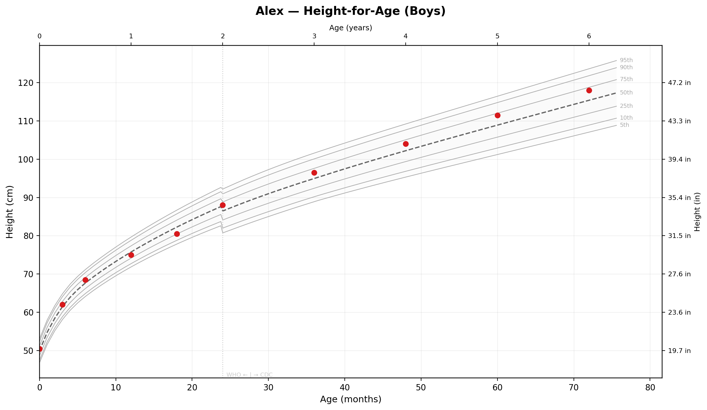
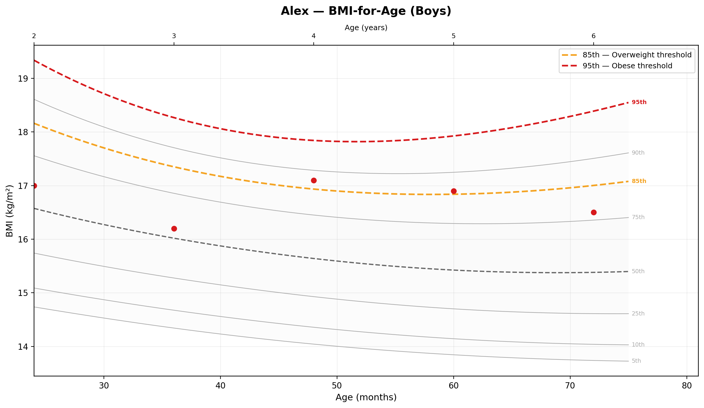
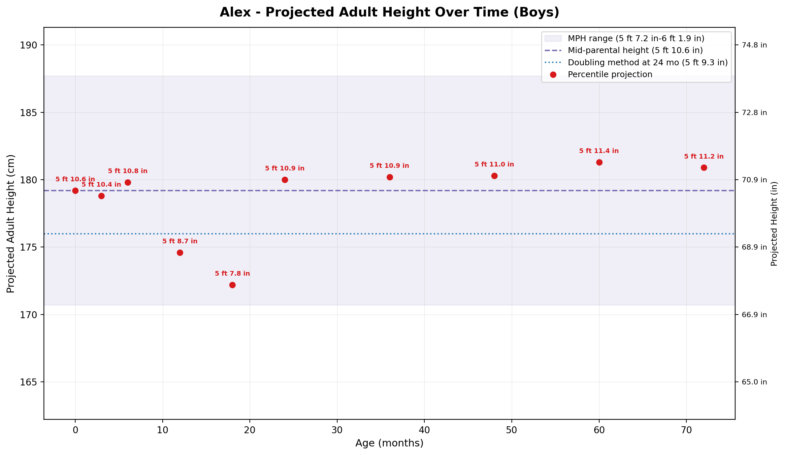
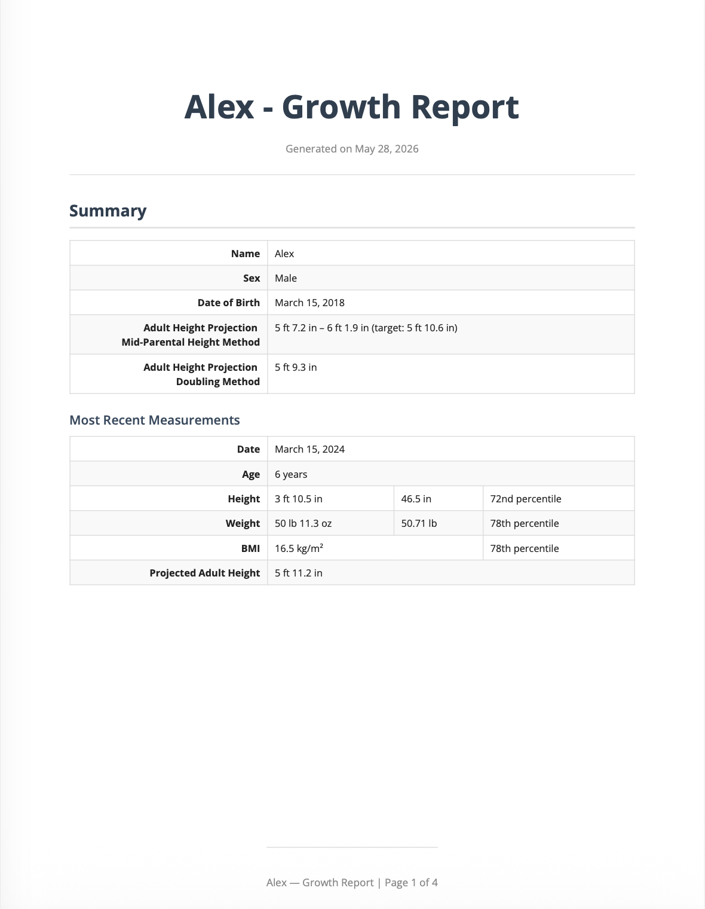

# Kids Growth Charts

A Python tool for plotting CDC/WHO pediatric growth charts, calculating percentiles, projecting adult height, and generating PDF reports — built for parents who want to track their kids' growth over time.



---

## Features

- **CDC/WHO growth charts** — height, weight, head circumference, and BMI plotted against reference percentile curves
- **Automatic chart selection** — WHO reference data for ages 0–24 months, CDC for 24+ months
- **Growth percentiles** — calculated using the LMS method from official CDC and WHO data files
- **Adult height projections** — three methods: mid-parental height, doubling method, and percentile-based projection over time
- **BMI charts** — with clinical threshold lines at the 85th (overweight) and 95th (obese) percentiles
- **Head circumference charts** — WHO 0–24 months, CDC 24–36 months
- **PDF reports** — polished multi-page PDF with embedded charts, summary statistics, and a full measurements table
- **Interactive CLI** — add measurements, children, and parental heights from the command line
- **Flexible unit input** — heights in feet/inches, decimal inches, or cm; weights in lb/oz, decimal lb, kg, or grams

---

## Screenshots

### Height-for-Age Chart


### BMI-for-Age Chart with Clinical Thresholds



### Projected Adult Height Over Time



### PDF Report



---

## Requirements

- Python 3.12+
- [Homebrew](https://brew.sh) (Mac) for WeasyPrint's system dependency

---

## Installation

```bash
# Clone the repo
git clone https://github.com/briannemg/kids-growth-charts.git
cd kids-growth-charts

# Create and activate a virtual environment
python -m venv .venv
source .venv/bin/activate  # Mac/Linux
.venv\Scripts\activate     # Windows

# Install dependencies
pip install -r requirements.txt

# Optional: PDF generation
brew install pango           # Mac only
pip install -r requirements-pdf.txt

# Download CDC/WHO reference data
python scripts/download_data.py

# Download fonts (required for PDF generation)
python scripts/download_fonts.py
```

---

## Usage

### Generate charts and reports

```bash
# Use the included sample data
python main.py

# Use your own data file
python main.py --data data/my_family.json

# Also generate PDF reports
python main.py --pdf

# Generate for one child only
python main.py --child "Alex"

# List children in a data file
python main.py --list
```

### Add measurements interactively

```bash
python scripts/add_measurement.py
python scripts/add_measurement.py --data data/my_family.json
```

The CLI walks you through adding children, measurements, and parental heights. Supports all common unit formats for height, weight, and head circumference.

### Output

Charts are saved to `output/charts/` and reports to `output/reports/`. Both directories are created automatically.

---

## Data format

Growth data is stored in a simple JSON file:

```json
{
  "family": {
    "father_height_cm": 180.3,
    "mother_height_cm": 165.1
  },
  "children": [
    {
      "name": "Alex",
      "sex": "M",
      "dob": "2018-03-15",
      "measurements": [
        {
          "date": "2018-03-15",
          "height_cm": 50.5,
          "weight_kg": 3.4,
          "head_circumference_cm": 34.5
        }
      ]
    }
  ]
}
```

All values are in metric units (cm, kg). Use `scripts/add_measurement.py` to add data — it handles unit conversion automatically. A sample data file is included at `data/dummy_data.json`.

All measurement fields except `date` are optional — you can record weight-only visits, height-only visits, or any combination.

---

## How percentiles are calculated

Percentiles are calculated using the **LMS method** developed by the CDC and WHO. Each reference table provides three parameters per age and sex:

- **L** — Box-Cox power transformation
- **M** — median value
- **S** — generalized coefficient of variation

These are used to compute a z-score, which is then converted to a percentile using the standard normal distribution.

For more information:

- [CDC Growth Charts](https://www.cdc.gov/growthcharts/)
- [WHO Child Growth Standards](https://www.who.int/tools/child-growth-standards)
- [CDC LMS Method Documentation](https://www.cdc.gov/growthcharts/percentile_data_files.htm)

---

## Adult height projection methods

Three independent methods are used:

**Mid-parental height (MPH)** — estimates a child's genetic height potential from the parents' heights. Target height ± 8.5 cm gives the expected range.

- Boys: (father + mother + 13) / 2
- Girls: (father + mother − 13) / 2

**Doubling method** — a child's height at a specific age is approximately half their adult height.

- Boys: double height at 24 months
- Girls: double height at 18 months

**Percentile projection** — carries the child's current height percentile forward to age 20 using the CDC reference curves, assuming their percentile remains stable.

---

## Project structure

```
kids-growth-charts/
├── data/
│   └── dummy_data.json          # Sample data file
├── docs/                        # README assets
├── growth_charts/
│   ├── models.py                # Child and Measurement data classes
│   ├── units.py                 # Unit converters and formatters
│   ├── percentiles.py           # LMS percentile calculations
│   ├── adult_height.py          # Adult height projection methods
│   ├── plotting.py              # Chart generation
│   ├── data_loader.py           # JSON data loading
│   ├── reporting.py             # Markdown report generation
│   ├── pdf_report.py            # PDF report generation
│   ├── data/                    # CDC/WHO CSV files (download separately)
│   └── fonts/                   # Font files (download separately)
├── scripts/
│   ├── download_data.py         # Downloads CDC/WHO reference data
│   ├── download_fonts.py        # Downloads fonts for PDF generation
│   └── add_measurement.py       # Interactive CLI for data entry
├── tests/                       # pytest test suite (278 tests)
├── main.py                      # Entry point
├── requirements.txt
└── requirements-pdf.txt
```

---

## Running tests

```bash
pytest
pytest -v              # verbose
pytest --cov           # with coverage report
```

---

## Acknowledgements

- Growth reference data from the [CDC](https://www.cdc.gov/growthcharts/) and [WHO](https://www.who.int/tools/child-growth-standards)
- Open Sans font by [Steve Matteson](https://fonts.google.com/specimen/Open+Sans), licensed under the [SIL Open Font License](https://scripts.sil.org/OFL)
- PDF generation powered by [WeasyPrint](https://weasyprint.org)

---

## License

MIT License — see [LICENSE](LICENSE) for details.
